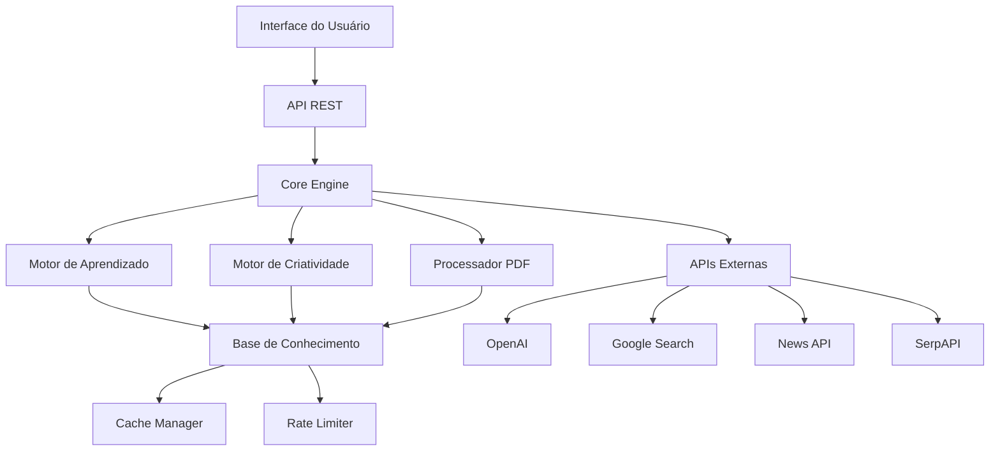

# CodeMaria - IA Autônoma e Criativa

CodeMaria é uma inteligência artificial autônoma e criativa, desenvolvida com foco em aprendizado contínuo e geração de conteúdo. Ela possui uma persona feminina brasileira e é capaz de evoluir através de auto-treinamento utilizando recursos da internet e documentos PDF.

## Características Principais

- 🧠 Aprendizado autônomo e contínuo
- 🎨 Criatividade e geração de conteúdo personalizado
- 📚 Processamento e análise de documentos PDF
- 🌐 Integração com diversas APIs (Google, OpenAI, etc.)
- 🔄 Cache inteligente e controle de rate limiting
- 👩‍🏫 Personalidade única e contextualizada
- 🇧🇷 Interface em português do Brasil
- 🌍 Processamento avançado de contexto geográfico e cultural

## Novidades na Última Atualização

### Melhorias no Processamento de Contexto

1. **Contexto Cultural**
   - Preservação de termos culturais com capitalização correta
   - Detecção aprimorada de referências históricas e artísticas
   - Adaptação do estilo de resposta baseado em subcategorias culturais
   - Garantia de inclusão de termos culturais relevantes nas respostas

2. **Contexto Geográfico**
   - Identificação precisa de localizações e referências geográficas
   - Ajuste automático do estilo baseado na urgência da consulta
   - Preservação de nomes próprios e referências locais
   - Respostas contextualizadas para consultas de localização

## Requisitos

- Python 3.9+
- Docker (opcional)
- Acesso à internet para auto-treinamento
- APIs necessárias:
  - OpenAI API
  - Google Search API
  - News API
  - SerpAPI (para busca acadêmica)

## Instalação

1. Clone o repositório:
```bash
git clone https://github.com/marcelaAn/CodeMarIA.git
cd CodeMarIA
```

2. Crie um ambiente virtual:
```bash
python -m venv venv
# Windows
venv\Scripts\activate
# Linux/macOS
source venv/bin/activate
```

3. Instale as dependências:
```bash
pip install -r requirements.txt
```

4. Configure as variáveis de ambiente:
- Copie o arquivo `.env.example` para `.env`
- Preencha as chaves de API necessárias
- **IMPORTANTE**: Nunca compartilhe suas chaves de API ou informações sensíveis

## Notebooks Jupyter

A CodeMaria inclui uma série de notebooks Jupyter que demonstram suas funcionalidades e servem como tutoriais interativos:

### Como Utilizar os Notebooks

1. **Preparação do Ambiente**:
   ```bash
   pip install jupyter notebook
   jupyter notebook
   ```

2. **Estrutura dos Notebooks**:
   - `00_Introducao.ipynb`: Visão geral do projeto e configuração inicial
   - `01_Learning.ipynb`: Demonstração do módulo de aprendizado
   - `02_Creativity.ipynb`: Exemplos de geração de conteúdo criativo
   - `03_PDF_Processing.ipynb`: Tutorial de processamento de PDFs
   - `04_API_Integrations.ipynb`: Guia de integração com APIs
   - `05_Examples.ipynb`: Exemplos práticos de uso

3. **Executando os Notebooks**:
   - Navegue até a pasta `notebooks/`
   - Clique no notebook desejado
   - Execute as células em sequência (Shift + Enter)
   - Siga as instruções e exemplos em cada notebook

4. **Dicas de Uso**:
   - Certifique-se de ter todas as dependências instaladas
   - Configure o arquivo `.env` antes de executar os notebooks
   - Leia os comentários e documentação em cada célula
   - Experimente modificar os exemplos para aprender mais

5. **Ordem Recomendada de Estudo**:
   1. Comece pelo notebook de introdução
   2. Explore o módulo de aprendizado
   3. Avance para criatividade e geração de conteúdo
   4. Aprenda sobre processamento de PDFs
   5. Explore as integrações com APIs
   6. Pratique com os exemplos

## Estrutura do Projeto

```
code_maria/
├── __init__.py
├── core.py           # Lógica principal
├── learning.py       # Motor de aprendizado
├── creativity.py     # Geração de conteúdo
├── persona.py        # Definição da personalidade
├── api_integrations.py # Integrações com APIs
├── pdf_processor.py  # Processamento de PDFs
├── pdf_trainer.py    # Treinamento com PDFs
├── rate_limiter.py   # Controle de requisições
├── cache_manager.py  # Gerenciamento de cache
├── schemas.py        # Schemas de validação
└── server.py         # API REST

tests/               # Testes unitários e de integração
├── __init__.py
├── conftest.py
├── test_core.py
├── test_learning.py
├── test_creativity.py
├── test_persona.py
├── test_api_integrations.py
├── test_pdf_processor.py
├── test_pdf_trainer.py
├── test_rate_limiter.py
├── test_cache_manager.py
└── test_knowledge.py

notebooks/           # Notebooks Jupyter
├── 00_Introducao.ipynb
├── 01_Learning.ipynb
├── 02_Creativity.ipynb
├── 03_PDF_Processing.ipynb
├── 04_API_Integrations.ipynb
└── 05_Examples.ipynb

data/               # Dados de treinamento
├── pdfs/          # PDFs para processamento
└── cache/         # Cache persistente
```

## Funcionalidades

### Processamento de PDFs
- Análise de conteúdo e estrutura
- Extração de texto e metadados
- Análise gramatical
- Análise de sentimentos
- Cache de resultados

### Aprendizado
- Aprendizado contínuo com PDFs e recursos web
- Extração de conhecimento da internet em tempo real
- Análise de sentimentos e contexto
- Atualização dinâmica da base de conhecimento
- Histórico de aprendizado e evolução
- Métricas de evolução e qualidade

### Aprendizado Contínuo da Internet

O CodeMaria utiliza diversas fontes online para manter seu conhecimento atualizado:

1. **Fontes de Dados**:
   - Artigos científicos via Google Scholar
   - Documentação técnica atualizada
   - Blogs e fóruns de tecnologia
   - Repositórios de código (GitHub, GitLab)
   - Feeds de notícias técnicas

2. **Processo de Aprendizado**:
   ```mermaid
   graph LR
       A[Coleta de Dados] --> B[Análise e Validação]
       B --> C[Extração de Conhecimento]
       C --> D[Integração à Base]
       D --> E[Avaliação de Qualidade]
       E --> F[Atualização do Modelo]
   ```

3. **Métricas de Qualidade**:
   - Relevância do conteúdo
   - Confiabilidade da fonte
   - Atualidade da informação
   - Coerência com conhecimento existente
   - Utilidade prática

4. **Ciclo de Atualização**:
   - Verificação diária de novas fontes
   - Processamento em tempo real
   - Validação cruzada de informações
   - Integração contínua ao conhecimento base
   - Descarte de informações obsoletas

5. **Áreas de Foco**:
   - Tendências em programação
   - Novas tecnologias e frameworks
   - Melhores práticas de desenvolvimento
   - Segurança e privacidade
   - Metodologias educacionais

6. **Controle de Qualidade**:
   - Validação por especialistas
   - Feedback dos usuários
   - Testes automatizados
   - Métricas de desempenho
   - Avaliação de impacto

### Criatividade
- Geração de conteúdo educacional
- Tutoriais personalizados
- Quizzes interativos
- Exemplos de código
- Adaptação ao nível do usuário

### Personalidade
- Persona brasileira feminina
- Adaptação do estilo de comunicação
- Empatia e didática
- Valores educacionais

### APIs e Integrações
- Busca na web
- Busca de artigos científicos
- Processamento de conteúdo web
- Rate limiting inteligente
- Cache de requisições

## Uso via API REST

### Endpoints Principais

```bash
POST /process           # Processa entrada do usuário
POST /upload-pdf        # Upload de PDF
POST /process-pdf-folder # Processa pasta de PDFs
POST /train-pdfs        # Treina com PDFs
GET  /training-stats    # Estatísticas de treinamento
GET  /pdf-stats         # Estatísticas de PDFs
```

### Exemplos de Uso da API

#### 1. Processamento de Entrada do Usuário
```bash
curl -X POST http://localhost:8000/process \
  -H "Content-Type: application/json" \
  -d '{
    "text": "Como funciona o aprendizado contínuo?",
    "context": "educational",
    "level": "intermediate"
  }'
```

Resposta:
```json
{
  "response": {
    "content": "O aprendizado contínuo na CodeMaria...",
    "type": "explanation",
    "confidence": 0.95
  },
  "metadata": {
    "processing_time": "0.5s",
    "sources": ["knowledge_base", "recent_learning"]
  }
}
```

#### 2. Upload de PDF
```bash
curl -X POST http://localhost:8000/upload-pdf \
  -F "file=@exemplo.pdf" \
  -F "metadata={\"category\":\"grammar\",\"language\":\"pt-BR\"}"
```

#### 3. Estatísticas de Treinamento
```bash
curl http://localhost:8000/training-stats
```

## Arquitetura do Sistema



### Componentes Principais

1. **Core Engine**: Coordena todas as operações e fluxos de dados
2. **Motor de Aprendizado**: Responsável pelo processamento e evolução do conhecimento
3. **Motor de Criatividade**: Gera conteúdo personalizado e adaptativo
4. **Processador PDF**: Extrai e analisa conteúdo de documentos
5. **Cache Manager**: Otimiza o acesso a dados frequentes
6. **Rate Limiter**: Controla o acesso às APIs externas

## Cobertura de Testes

⚠️ **Status Atual da Cobertura**: 12% (2229 statements, 1961 missed)

A cobertura de testes é uma métrica crucial para garantir a qualidade e confiabilidade do código. Atualmente, estamos trabalhando para melhorar nossa cobertura de testes, que está abaixo do ideal. Contribuições focadas em aumentar a cobertura são muito bem-vindas!

### Áreas Críticas para Melhoria

- `api_integrations.py`: 0% de cobertura
- `cache_manager.py`: 0% de cobertura
- `rate_limiter.py`: 0% de cobertura
- `pdf_trainer.py`: 77% de cobertura

### Metas de Cobertura

- Meta Curto Prazo: 50% de cobertura
- Meta Médio Prazo: 75% de cobertura
- Meta Longo Prazo: 90% de cobertura

### Como Contribuir com Testes

1. Identifique áreas com baixa cobertura usando:
   ```bash
   pytest --cov=code_maria --cov-report=html
   ```
2. Crie testes unitários focados em funções não testadas
3. Adicione testes de integração para fluxos complexos
4. Documente os casos de teste no código

## Contribuindo

### Como Contribuir

1. **Fork e Clone**
   ```bash
   git clone https://github.com/seu-usuario/CodeMarIA.git
   cd CodeMarIA
   ```

2. **Crie uma Branch**
   ```bash
   git checkout -b feature/sua-feature
   ```

3. **Desenvolva**
   - Siga o estilo de código do projeto
   - Adicione testes para novas funcionalidades
   - Mantenha a documentação atualizada

4. **Teste**
   ```bash
   pytest
   flake8
   black .
   ```

5. **Commit**
   ```bash
   git commit -m "feat: adiciona nova funcionalidade"
   ```

6. **Push e Pull Request**
   ```bash
   git push origin feature/sua-feature
   ```

### Diretrizes de Código

- Use Python 3.9+ features
- Siga PEP 8
- Documente usando docstrings
- Mantenha funções pequenas e focadas
- Use type hints
- Escreva testes unitários

### Reportando Bugs

1. Verifique se o bug já não foi reportado
2. Use o template de bug report
3. Inclua:
   - Versão do Python
   - Sistema operacional
   - Passos para reproduzir
   - Comportamento esperado vs atual
   - Logs relevantes

### Solicitando Features

1. Verifique se a feature já não foi solicitada
2. Use o template de feature request
3. Descreva:
   - Problema que a feature resolve
   - Solução proposta
   - Alternativas consideradas
   - Contexto adicional

## Agradecimentos

Agradecemos a todos que contribuíram para o desenvolvimento deste projeto:

- Contribuidores de código
- Testadores
- Revisores de documentação
- Comunidade de usuários

## Licença

Este projeto está sob a licença MIT. Veja o arquivo [LICENSE](LICENSE) para mais detalhes.

## Desenvolvimento

O projeto está em desenvolvimento ativo. Contribuições são bem-vindas!

### Ambiente de Desenvolvimento

1. **Configuração do Ambiente**
   ```bash
   # Instalar dependências de desenvolvimento
   pip install -r requirements-dev.txt
   
   # Configurar pre-commit hooks
   pre-commit install
   ```

2. **Docker**
   ```bash
   # Construir imagem
   docker build -t codemaria .
   
   # Executar container
   docker run -p 8000:8000 codemaria
   ```

### Executando Testes

```bash
# Todos os testes
pytest

# Testes específicos
pytest tests/test_pdf_trainer.py
pytest tests/test_knowledge.py

# Com cobertura
pytest --cov=code_maria
```

### Checklist de Segurança

Antes de contribuir, certifique-se de:
- ✅ Remover todas as referências a caminhos locais
- ✅ Não incluir chaves de API ou senhas
- ✅ Remover informações pessoais dos logs
- ✅ Usar variáveis de ambiente para configurações sensíveis
- ✅ Verificar arquivos de cache e logs antes do commit

## Privacidade e Segurança

Este projeto segue as melhores práticas de segurança e privacidade:

1. **Dados Sensíveis**
   - Todas as chaves de API devem ser armazenadas em variáveis de ambiente
   - Nunca commite o arquivo `.env`
   - Use o `.gitignore` para excluir arquivos sensíveis

2. **Logs e Cache**
   - Limpe logs antes do commit
   - Não inclua dados pessoais nos logs
   - Mantenha o cache local

3. **Contribuições**
   - Verifique seus commits por informações sensíveis
   - Use ferramentas de sanitização quando necessário
   - Siga o guia de contribuição

## Documentação dos Notebooks

Os notebooks Jupyter são uma parte essencial da documentação do projeto. Cada notebook contém:

### Estrutura Comum dos Notebooks

1. **Introdução**
   - Objetivo do notebook
   - Pré-requisitos
   - Configuração necessária

2. **Exemplos Práticos**
   - Casos de uso comuns
   - Exemplos de código
   - Resultados esperados

3. **Explicações Detalhadas**
   - Conceitos fundamentais
   - Fluxo de dados
   - Decisões de design

4. **Troubleshooting**
   - Problemas comuns
   - Soluções
   - Dicas de otimização

### Melhores Práticas

- Execute todas as células em ordem
- Verifique as dependências listadas
- Leia os comentários explicativos
- Experimente modificar os exemplos
- Consulte a documentação relacionada 